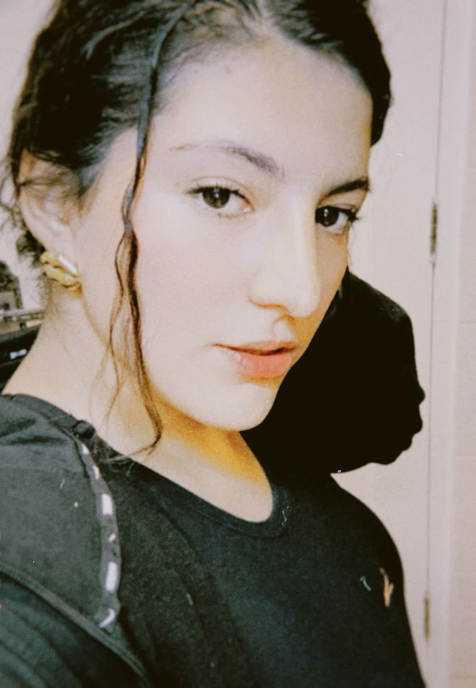
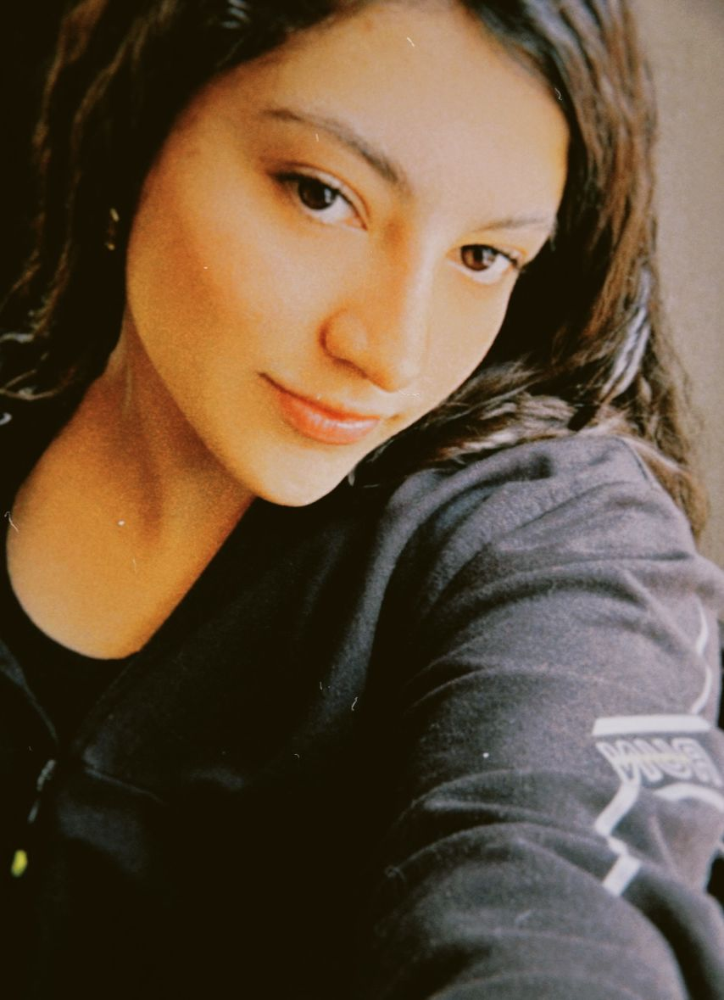
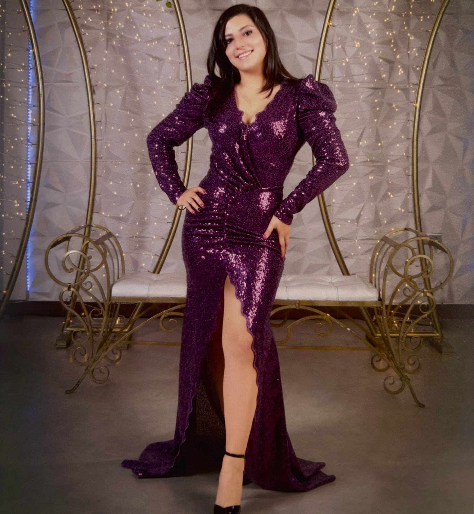
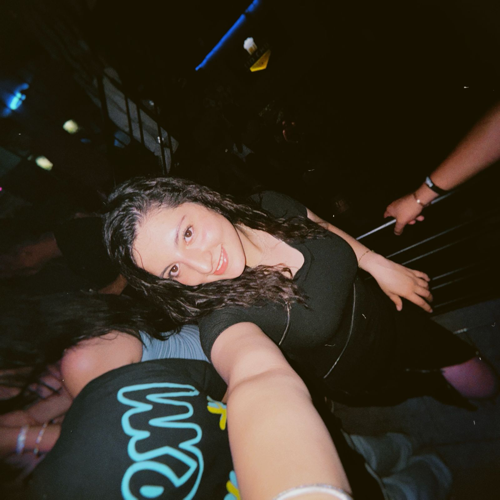

<!DOCTYPE html>
<html lang="es">
<head>
  <meta charset="UTF-8">
  <meta name="viewport" content="width=device-width, initial-scale=1.0">
  <title>Valentina Valda</title>
  <link rel="stylesheet" href="tinaa.css">
</head>
<body>
  

    <header>
      <h1>🌸 Natalia Valentina Valda Ibáñez 🌸</h1>
      
Estudiante de Ingeniería de Sistemas Informáticos - Segundo año en Uivalle Sucre

      
Cumpleaños: 12 de agosto

      
Apasionada por bailar, escuchar música en inglés y traducir para practicar mi inglés. Emprendedora de <strong>Bad Bunny Vape Shop</strong>.

    </header>
    

      
      
      
      
    

    <section class="seccion">
      <h2>Sobre Mi</h2>
      
Soy Valentina, amante de la danza y la música. Disfruto explorar diferentes ritmos y siempre estoy en la búsqueda de nuevos desafíos para mejorar mi inglés traduciendo canciones. Mi energía y creatividad me impulsan a alcanzar mis sueños.

    </section>
    <section class="seccion">
      <h2>Mi Emprendimiento: Bad Bunny Vape Shop</h2>
      <ul class="lista">
        <li>Inicié mi primer emprendimiento en 2023, consolidando mi tienda.</li>
        <li>Bad Bunny Vape Shop nació a finales de 2022 con varios nombres alternativos.</li>
        <li>En 2024, el negocio ya contaba con un nombre sólido y un punto de entrega físico.</li>
        <li>Ofrezco productos de alta calidad para los amantes del vapeo.</li>
      </ul>
      <a href="https://www.instagram.com/badbunnyvapebo/" class="boton">Visita mi IG</a>
    </section>
    <footer>
      
© 2024 Valentina Valda | Todos los derechos reservados

    </footer>
  

</body>
</html>

:root {
    --primary-color: #ff66b2;
    --secondary-color: #cc3366;
    --text-color: #fff;
    --background-color: #000;
    --transition-speed: 0.3s;
  }
  
  body {
    font-family: 'Arial', sans-serif;
    background-color: #ffe6f2;
    color: #333;
    margin: 0;
    padding: 20px;
    display: flex;
    justify-content: center;
    align-items: center;
    min-height: 100vh;
  }
  
  .contenido {
    width: 85%;
    max-width: 650px;
    background: #fff;
    padding: 25px;
    border-radius: 12px;
    box-shadow: 0 4px 10px rgba(0, 0, 0, 0.1);
    text-align: center;
    transition: transform 0.3s ease;
  }
  
  .contenido:hover {
    transform: scale(1.02);
  }
  
  header {
    background-color: var(--primary-color);
    color: #fff;
    padding: 20px;
    border-radius: 12px 12px 0 0;
    position: relative;
  }
  
  header::after {
    content: "";
    position: absolute;
    bottom: -10px;
    left: 50%;
    transform: translateX(-50%);
    width: 50%;
    height: 5px;
    background-color: rgba(255, 255, 255, 0.6);
    border-radius: 5px;
  }
  
  header h1 {
    margin: 0;
    font-size: 2.2em;
  }
  
  .subtitulo {
    font-size: 16px;
    margin: 5px 0;
  }
  
  .descripcion {
    font-size: 14px;
    font-style: italic;
  }
  
  .imagen-container {
    margin: 20px 0;
    position: relative;
    overflow: hidden;
    border-radius: 12px;
    border: 3px solid var(--primary-color);
    box-shadow: 0 4px 10px rgba(0, 0, 0, 0.1);
    transition: transform 0.3s ease;
  }
  
  .imagen-container:hover {
    transform: scale(1.03);
  }
  
  .imagen-perfil {
    width: 100%;
    max-width: 250px;
    height: auto;
    border-radius: 12px;
    box-shadow: 0 2px 8px rgba(0, 0, 0, 0.2);
    transition: transform 0.3s ease, filter 0.3s ease;
  }
  
  .imagen-perfil:hover {
    transform: scale(1.05);
    filter: brightness(1.05);
  }
  
  .seccion {
    margin-top: 20px;
    padding: 15px;
    background: #fff0f5;
    border-radius: 10px;
    box-shadow: 0 2px 5px rgba(0,0,0,0.1);
    transition: box-shadow 0.3s ease;
  }
  
  .seccion:hover {
    box-shadow: 0 4px 10px rgba(0,0,0,0.2);
  }
  
  .seccion h2 {
    color: var(--secondary-color);
    margin-bottom: 10px;
  }
  
  .lista {
    list-style: none;
    padding: 0;
  }
  
  .lista li {
    background: #ffb3d9;
    margin: 6px 0;
    padding: 10px;
    border-radius: 6px;
    font-size: 15px;
    transition: transform 0.3s ease, box-shadow 0.3s ease;
  }
  
  .lista li:hover {
    transform: translateX(5px);
    box-shadow: 2px 2px 6px rgba(0,0,0,0.15);
  }
  
  .boton {
    display: inline-block;
    margin-top: 10px;
    padding: 10px 15px;
    background: #fff6a3;
    color: #fff;
    text-decoration: none;
    border-radius: 6px;
    font-weight: bold;
    transition: background 0.3s, transform 0.3s;
  }
  
  .boton:hover {
    background: #e60073;
    transform: scale(1.05);
  }
  
  footer {
    margin-top: 25px;
    font-size: 14px;
    color: #777;
  }
  
  @media (max-width: 600px) {
    .contenido {
      width: 95%;
      padding: 15px;
    }
    header h1 {
      font-size: 1.8em;
    }
    .imagen-perfil {
      max-width: 200px;
    }
    .subtitulo,
    .descripcion,
    .lista li {
      font-size: 14px;
    }
  }
  

